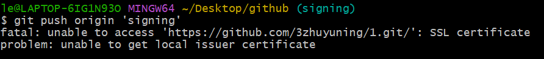
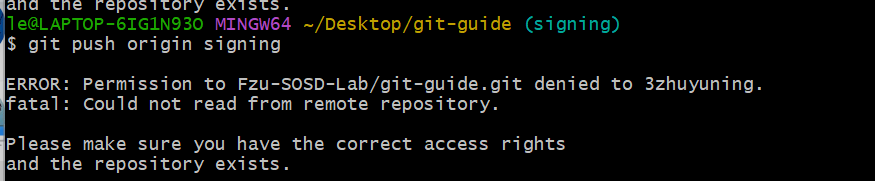

# 关于我第一次提交pr时踩过的坑（以下为图例及相应的解决办法）
## 1.工作路径错误
注意最上端的工作路径，要使自己的每一次操作都是对应正确的文件，即最后的那个文件（或文件夹)名是我们想要对其操作的目标，如我就是想对文件夹git-guide操作但该工作路径的最后是文件夹github，因而出现报错

#### 这时候我们要将工作路径纠正，可以使用以下命令跳转到正确的文件（或文件夹）再进行操作
```shell
cd 文件名
```
ps.注意此时为相对路径，即cd的文件只能是该路径中的文件
## 2.未clone自己的仓库
出现以上报错是因为直接push到我们fork的仓库中，这时候我们应先将自己的仓库clone到本地，再将修改push到自己的仓库

